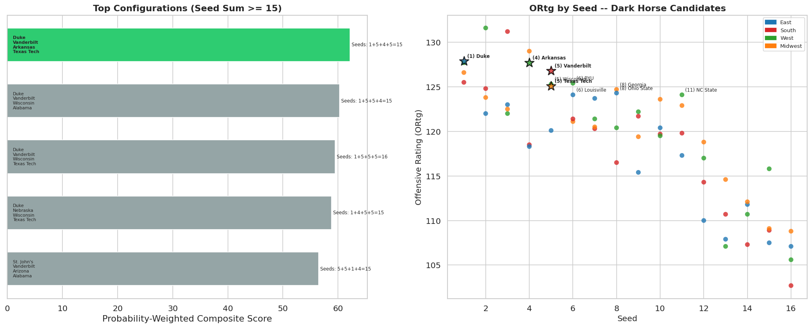

# March Madness 2026: Data-Driven Final Four Analysis

A composite analytical pipeline that predicts NCAA Tournament Final Four teams using KenPom efficiency metrics, real NCAA NET rankings, committee evaluation metrics (SOR, WAB, KPI, BPI), Monte Carlo bracket simulation, and seed-constraint optimization.

## How It Works

1. **Composite Scoring** -- Each team gets a weighted score from 9 normalized (0-100) metrics
2. **Monte Carlo Simulation** -- 10,000 bracket simulations per region using efficiency differentials
3. **Seed-Constrained Optimization** -- Brute-force search for the highest-scoring Final Four with seed sum >= 15

## Data Sources

| Data | File | Source |
|------|------|--------|
| KenPom efficiency ratings | `kenpom.csv` | [kenpom.com](https://kenpom.com) |
| NCAA NET rankings + quad records | `ncaa-net-rankings.csv` | [ncaa.com](https://www.ncaa.com/rankings/basketball-men/d1/ncaa-mens-basketball-net-rankings) |
| Team sheet metrics (SOR, WAB, KPI, BPI) | `scraped_data/tournament_teams.csv` | [warrennolan.com](https://www.warrennolan.com/basketball/2026/net-teamsheets-plus) |
| Game-by-game results | `scraped_data/tournament_games.csv` | [warrennolan.com](https://www.warrennolan.com/basketball/2026/net-teamsheets-plus) |
| Tournament bracket | `bracket.csv` | Manual entry |

## Quickstart

```bash
pip install -r requirements.txt
jupyter notebook final_four_analysis.ipynb
```

To refresh scraped data from Warren Nolan:

```bash
python scrape_net_teamsheets.py
python filter_tournament_teams.py
```

## Composite Model Weights

The full scheme uses 9 independent features (no KenPom/NET double-counting):

| Metric | Weight | Source |
|--------|--------|--------|
| KenPom Net Rating | 0.20 | kenpom.csv |
| KenPom Offensive Rating | 0.10 | kenpom.csv |
| KenPom Defensive Rating (inv) | 0.10 | kenpom.csv |
| NCAA NET Rank (inv) | 0.15 | ncaa-net-rankings.csv |
| Strength of Record (inv) | 0.10 | tournament_teams.csv |
| Wins Above Bubble | 0.10 | tournament_teams.csv |
| NET Strength of Schedule (inv) | 0.05 | tournament_teams.csv |
| Q1 Win % | 0.10 | ncaa-net-rankings.csv |
| Q1+Q2 Win % | 0.10 | ncaa-net-rankings.csv |

Fallback weight schemes activate when team sheet or quad data is unavailable.

## Monte Carlo Simulation

Win probability uses a logistic function on KenPom net efficiency differentials:

```
P(A wins) = 1 / (1 + 10^(-(NetRtg_A - NetRtg_B) / 22))
```

Each region is simulated 10,000 times (R64 -> R32 -> Sweet 16 -> Elite 8) to produce Final Four probabilities.

## Results

### Optimal Final Four

**Duke | Vanderbilt | Arkansas | Texas Tech** (Seed sum: 1+5+4+5 = 15)

| Pick | Region | Seed | KP# | NET# | Composite | FF Prob | Type |
|------|--------|------|-----|------|-----------|---------|------|
| Duke | East | 1 | #1 | #1 | 87.5 | 54.6% | Chalk |
| Vanderbilt | South | 5 | #12 | #13 | 72.4 | 8.2% | Dark Horse |
| Arkansas | West | 4 | #15 | #15 | 70.4 | 7.4% | Moderate |
| Texas Tech | Midwest | 5 | #20 | #19 | 67.6 | 4.9% | Dark Horse |

### Top 20 by Composite Score

| # | Team | Region | Seed | Composite | NetRtg | NET# | SOR | WAB |
|---|------|--------|------|-----------|--------|------|-----|-----|
| 1 | Duke | East | 1 | 87.5 | 38.90 | 1 | 3 | 2 |
| 2 | Arizona | West | 1 | 86.5 | 37.62 | 3 | 1 | 3 |
| 3 | Michigan | Midwest | 1 | 85.7 | 37.58 | 2 | 2 | 1 |
| 4 | Florida | South | 1 | 79.1 | 33.78 | 4 | 5 | 6 |
| 5 | Houston | South | 2 | 78.5 | 33.39 | 5 | 6 | 5 |
| 6 | Gonzaga | West | 3 | 76.3 | 28.10 | 7 | 11 | 17 |
| 7 | Iowa State | Midwest | 2 | 76.2 | 32.38 | 6 | 14 | 9 |
| 8 | Purdue | West | 2 | 75.4 | 31.19 | 9 | 7 | 4 |
| 9 | UConn | East | 2 | 75.2 | 27.85 | 10 | 4 | 7 |
| 10 | Illinois | South | 3 | 74.2 | 32.09 | 8 | 17 | 18 |
| 11 | Michigan State | East | 3 | 73.4 | 28.30 | 11 | 13 | 12 |
| 12 | Virginia | Midwest | 3 | 73.1 | 26.71 | 12 | 9 | 8 |
| 13 | Vanderbilt | South | 5 | 72.4 | 27.50 | 13 | 12 | 10 |
| 14 | Nebraska | South | 4 | 71.9 | 26.15 | 14 | 10 | 13 |
| 15 | St. John's | East | 5 | 70.5 | 25.89 | 16 | 16 | 14 |
| 16 | Arkansas | West | 4 | 70.4 | 26.04 | 15 | 8 | 11 |
| 17 | Alabama | Midwest | 4 | 69.7 | 25.70 | 18 | 15 | 15 |
| 18 | Kansas | East | 4 | 68.4 | 24.41 | 21 | 18 | 16 |
| 19 | Louisville | East | 6 | 67.8 | 25.42 | 17 | 26 | 24 |
| 20 | Texas Tech | Midwest | 5 | 67.6 | 25.20 | 19 | 20 | 19 |

### Monte Carlo Simulation (10,000 sims per region)

| East | | South | | West | | Midwest | |
|------|---|-------|---|------|---|---------|---|
| (1) Duke | 54.6% | (1) Florida | 30.3% | (1) Arizona | 48.9% | (1) Michigan | 47.8% |
| (2) UConn | 12.8% | (2) Houston | 26.0% | (2) Purdue | 21.7% | (2) Iowa State | 24.1% |
| (3) Michigan St | 11.8% | (3) Illinois | 22.3% | (3) Gonzaga | 11.3% | (3) Virginia | 8.2% |
| (5) St. John's | 5.9% | (5) Vanderbilt | 8.2% | (4) Arkansas | 7.4% | (4) Alabama | 5.9% |
| (4) Kansas | 5.1% | (4) Nebraska | 7.2% | (5) Wisconsin | 3.8% | (5) Texas Tech | 4.9% |

### Visualizations

#### Offensive vs Defensive Efficiency


#### Top 25 by Composite Score


#### Regional Contender Comparison


#### Seed Constraint Configs & Dark Horse Candidates


## Project Structure

```
final_four_analysis.ipynb       # Main notebook (run all cells)
requirements.txt                # Python dependencies
scripts/
  scrape_net_teamsheets.py        # Scrapes Warren Nolan team sheets
  filter_tournament_teams.py      # Filters scraped data to tournament teams
scraped_data/
  tournament_teams.csv          # Team-level metrics (68 teams)
  tournament_games.csv          # Game-by-game results (~2200 games)
  quad_records.csv              # Q1/Q2 win-loss records
  ncaa-net-rankings.csv           # NCAA NET rankings (365 D1 teams)
  kenpom.csv                      # KenPom efficiency data (68 tournament teams)
  bracket.csv                     # Tournament bracket (32 first-round games)
```

## Key Metrics Glossary

| Metric | Source | Description |
|--------|--------|-------------|
| NetRtg | [KenPom](https://kenpom.com) | Adjusted efficiency margin (points per 100 possessions) |
| ORtg / DRtg | [KenPom](https://kenpom.com) | Adjusted offensive / defensive efficiency |
| NET Rank | [NCAA](https://www.ncaa.com/rankings/basketball-men/d1/ncaa-mens-basketball-net-rankings) | Official NCAA evaluation tool used by the selection committee |
| SOR | [Warren Nolan](https://www.warrennolan.com/basketball/2026/net-teamsheets-plus) | Strength of Record -- resume quality ranking |
| WAB | [Warren Nolan](https://www.warrennolan.com/basketball/2026/net-teamsheets-plus) | Wins Above Bubble -- wins beyond the tournament bubble threshold |
| KPI | [Warren Nolan](https://www.warrennolan.com/basketball/2026/net-teamsheets-plus) | Kevin Pauga Index -- predictive metric used by the committee |
| BPI | [ESPN](https://www.espn.com/mens-college-basketball/bpi) | Basketball Power Index |
| Q1 / Q2 | [NCAA NET](https://www.ncaa.com/rankings/basketball-men/d1/ncaa-mens-basketball-net-rankings) | Quadrant records (Q1: vs top 75, Q2: vs 76-150) |
