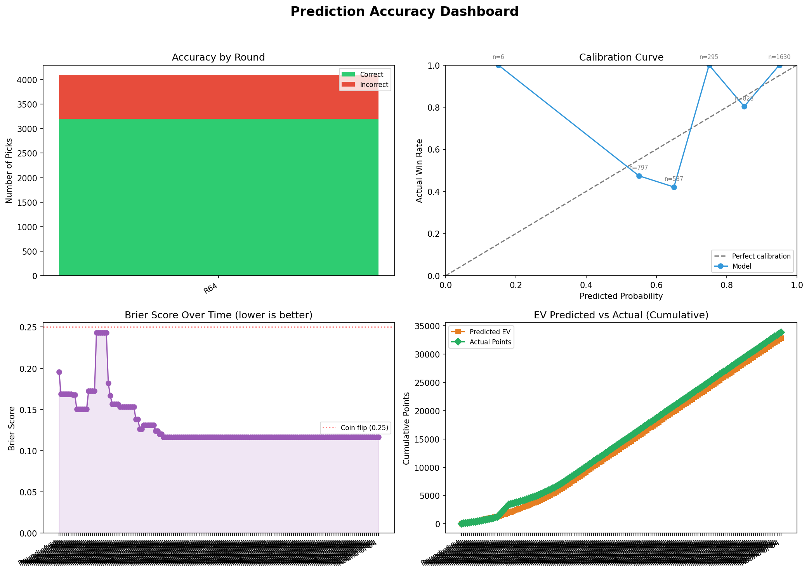
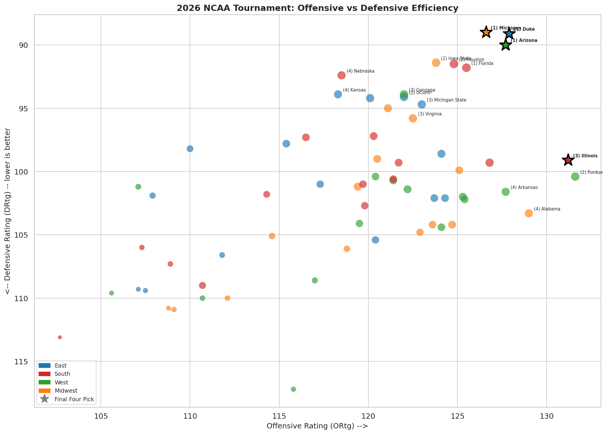
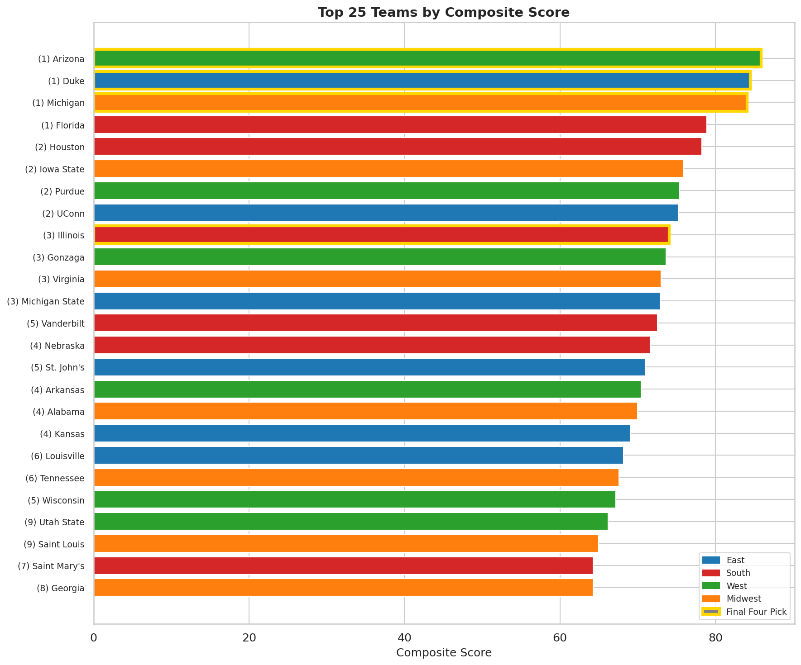
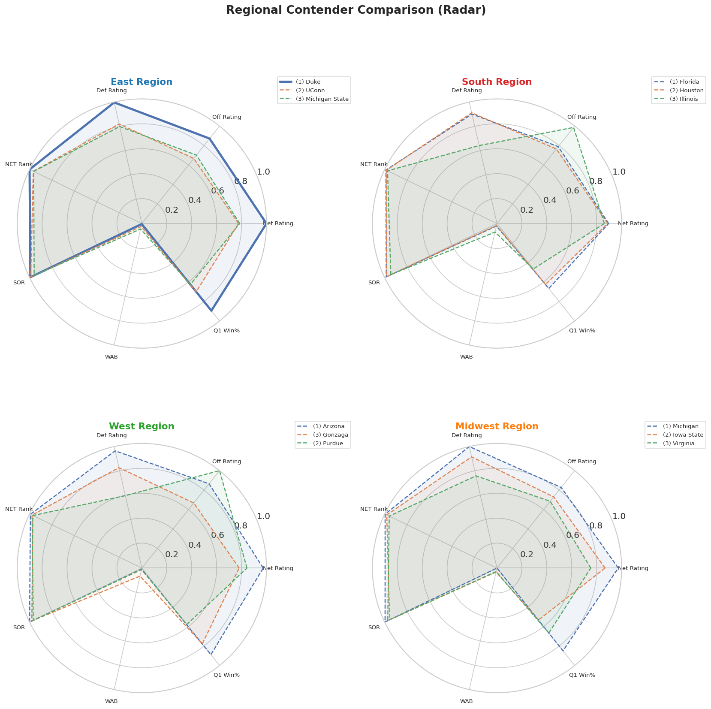
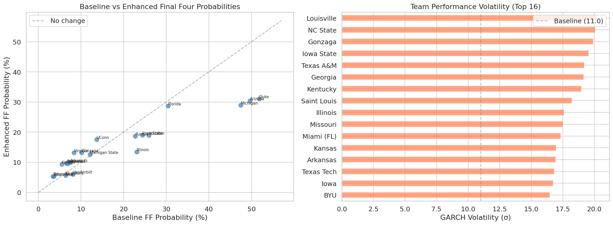
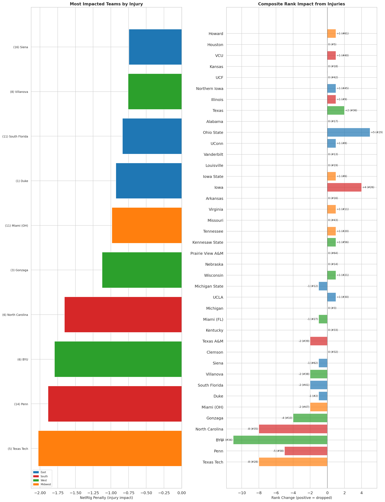
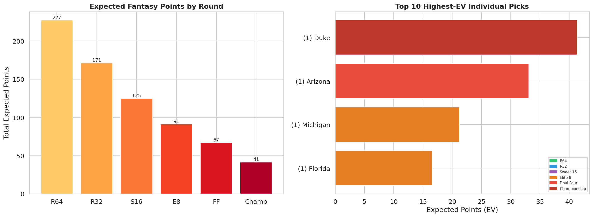

# March Madness 2026: Live Bracket Analysis & Prediction Engine

A live tournament prediction pipeline that generates a full 63-game bracket, tracks accuracy in real-time, and refits models as results come in. Built on KenPom efficiency metrics, NCAA NET rankings, committee evaluation metrics (SOR, WAB, KPI, BPI), quantitative models (GARCH volatility, HMM regime detection, Kalman momentum filtering, historical seed priors), Monte Carlo simulation, and EV-optimized bracket construction with contrarian leverage overlay.

<!-- ACCURACY_START -->
## Tournament Accuracy Tracker

*Last updated: 2026-03-19T22:32:20Z*

| Metric | Value |
|--------|-------|
| Games tracked | 7 |
| Correct picks | 5/7 |
| Accuracy | 71.4% |
| Upsets caught | 0/2 |


<!-- ACCURACY_END -->

## How It Works

1. **Composite Scoring** -- Each team gets a weighted score from up to 11 normalized (0-100) metrics
2. **Injury Adjustment** -- Real-time injury data adjusts team NetRtg values using player impact penalties
3. **Quantitative Enhancements** -- GARCH volatility replaces fixed win-probability divisor, HMM detects team regime states, Kalman filter tracks momentum, historical seed priors provide Bayesian blending
4. **Monte Carlo Simulation** -- 10,000 full-bracket simulations (63 games each) with both baseline and enhanced models
5. **EV-Optimized Bracket** -- Per-slot expected value optimization with contrarian leverage adjustment

## Data Sources

| Data | File | Source |
|------|------|--------|
| KenPom efficiency ratings | `kenpom.csv` | [kenpom.com](https://kenpom.com) |
| NCAA NET rankings + quad records | `ncaa-net-rankings.csv` | [ncaa.com](https://www.ncaa.com/rankings/basketball-men/d1/ncaa-mens-basketball-net-rankings) |
| Team sheet metrics (SOR, WAB, KPI, BPI) | `scraped_data/tournament_teams.csv` | [warrennolan.com](https://www.warrennolan.com/basketball/2026/net-teamsheets-plus) |
| Game-by-game results | `scraped_data/tournament_games.csv` | [warrennolan.com](https://www.warrennolan.com/basketball/2026/net-teamsheets-plus) |
| Tournament bracket | `bracket.csv` | Manual entry |
| Injury reports | `scraped_data/injuries.csv` | [boydsbets.com](https://www.boydsbets.com/college-basketball-injuries/) |
| Player stats (MPG, PPG) | `scraped_data/player_stats.csv` | [espn.com](https://www.espn.com/mens-college-basketball/) |
| Injury adjustments | `scraped_data/injury_adjustments.csv` | Computed from injuries + player stats + KenPom |
| Historical seed win rates | `scraped_data/historical_seed_rates.csv` | [Wikipedia](https://en.wikipedia.org/wiki/NCAA_tournament) (1985+) |

## Quickstart

```bash
pip install -r requirements.txt
jupyter notebook final_four_analysis.ipynb
```

## Refreshing Data

**Warren Nolan team sheets:**

```bash
python scripts/scrape_net_teamsheets.py
python scripts/filter_tournament_teams.py
```

**Injury data (full pipeline):**

```bash
# Step 1: Scrape injury reports (boydsbets.com -- not in sandbox allowlist)
python scripts/scrape_injuries.py --refresh

# Step 2: Scrape player stats from ESPN + compute injury adjustments
# Takes ~1 min (68 teams, ~0.7s courtesy delay between requests)
python scripts/scrape_player_stats.py --refresh

# Step 3: Re-run the notebook with injury-adjusted data
jupyter nbconvert --execute final_four_analysis.ipynb --to notebook
```

Both scrapers cache results for 6 hours. Use `--refresh` to force re-scrape.

**Historical seed data:**

```bash
python scripts/scrape_historical_brackets.py
```

Falls back to hardcoded rates if Wikipedia is unavailable.

**Without injury/quant data:** The notebook gracefully degrades -- it runs the original 9-feature model with unadjusted NetRtg values. No scrapers or quant dependencies required.

## Composite Model Weights

With all enhancements, the full scheme uses 11 features. The model degrades gracefully when components are unavailable.

| Metric | Enhanced | Baseline | Source |
|--------|:--------:|:--------:|--------|
| KenPom Net Rating | 0.15 | 0.175 | kenpom.csv |
| KenPom Offensive Rating | 0.10 | 0.10 | kenpom.csv |
| KenPom Defensive Rating (inv) | 0.10 | 0.10 | kenpom.csv |
| NCAA NET Rank (inv) | 0.10 | 0.125 | ncaa-net-rankings.csv |
| Strength of Record (inv) | 0.10 | 0.10 | tournament_teams.csv |
| Wins Above Bubble | 0.10 | 0.10 | tournament_teams.csv |
| NET Strength of Schedule (inv) | 0.05 | 0.05 | tournament_teams.csv |
| Q1 Win % | 0.10 | 0.10 | ncaa-net-rankings.csv |
| Q1+Q2 Win % | 0.10 | 0.10 | ncaa-net-rankings.csv |
| Injury Health | 0.05 | 0.05 | injury_adjustments.csv |
| **Kalman Momentum** | **0.05** | -- | quant_models.py |

Additional fallback weight schemes activate when team sheet or quad data is unavailable.

## Monte Carlo Simulation

**Baseline model** uses a logistic function on injury-adjusted net efficiency differentials with a fixed divisor:

```
P(A wins) = 1 / (1 + 10^(-(NetRtg_A - NetRtg_B) / 22))
```

**Enhanced model** replaces the fixed divisor with per-matchup GARCH volatility, applies HMM regime adjustments, and blends with historical seed priors:

```
combined_vol = sqrt(GARCH_vol_A^2 + GARCH_vol_B^2)    # replaces fixed 22
P_model = 1 / (1 + 10^(-margin / combined_vol))        # volatility-adjusted
P_final = bayesian_blend(P_model, historical_prior)     # seed-aware blending
```

Each model runs 10,000 full-bracket simulations (63 games: R64 through Championship). The notebook outputs a side-by-side comparison.

## Results

### Top 20 by Composite Score

| # | Team | Region | Seed | Composite | NetRtg | NET# | SOR | WAB |
|---|------|--------|------|-----------|--------|------|-----|-----|
| 1 | Arizona | West | 1 | 86.6 | 37.62 | 3 | 1 | 3 |
| 2 | Duke | East | 1 | 85.2 | 38.90 | 1 | 3 | 2 |
| 3 | Michigan | Midwest | 1 | 84.7 | 37.58 | 2 | 2 | 1 |
| 4 | Florida | South | 1 | 79.4 | 33.78 | 4 | 5 | 6 |
| 5 | Houston | South | 2 | 78.7 | 33.39 | 5 | 6 | 5 |
| 6 | Iowa State | Midwest | 2 | 76.3 | 32.38 | 6 | 14 | 9 |
| 7 | Purdue | West | 2 | 75.9 | 31.19 | 9 | 7 | 4 |
| 8 | UConn | East | 2 | 75.7 | 27.85 | 10 | 4 | 7 |
| 9 | Illinois | South | 3 | 74.5 | 32.09 | 8 | 17 | 18 |
| 10 | Gonzaga | West | 3 | 74.2 | 28.10 | 7 | 11 | 17 |
| 11 | Virginia | Midwest | 3 | 73.5 | 26.71 | 12 | 9 | 8 |
| 12 | Michigan State | East | 3 | 73.2 | 28.30 | 11 | 13 | 12 |
| 13 | Vanderbilt | South | 5 | 72.9 | 27.50 | 13 | 12 | 10 |
| 14 | Nebraska | South | 4 | 72.0 | 26.15 | 14 | 10 | 13 |
| 15 | St. John's | East | 5 | 71.3 | 25.89 | 16 | 16 | 14 |
| 16 | Arkansas | West | 4 | 70.9 | 26.04 | 15 | 8 | 11 |
| 17 | Alabama | Midwest | 4 | 70.4 | 25.70 | 18 | 15 | 15 |
| 18 | Kansas | East | 4 | 69.2 | 24.41 | 21 | 18 | 16 |
| 19 | Louisville | East | 6 | 68.4 | 25.42 | 17 | 26 | 24 |
| 20 | Tennessee | Midwest | 6 | 67.8 | 26.02 | 20 | 22 | 23 |

### Baseline Monte Carlo (10,000 sims per region)

| East | | South | | West | | Midwest | |
|------|---|-------|---|------|---|---------|---|
| (1) Duke | 51.8% | (1) Florida | 30.5% | (1) Arizona | 49.7% | (1) Michigan | 47.5% |
| (2) UConn | 13.7% | (2) Houston | 25.9% | (2) Purdue | 22.8% | (2) Iowa State | 24.4% |
| (3) Michigan St | 12.1% | (3) Illinois | 23.1% | (3) Gonzaga | 10.2% | (3) Virginia | 8.4% |
| (5) St. John's | 6.4% | (5) Vanderbilt | 8.1% | (4) Arkansas | 7.5% | (4) Alabama | 6.6% |
| (4) Kansas | 5.5% | (4) Nebraska | 6.9% | (5) Wisconsin | 3.7% | (6) Tennessee | 4.8% |

### Enhanced vs Baseline Final Four Probabilities (Top 16)

The enhanced model (GARCH + HMM + Kalman + historical priors) redistributes probability mass away from top seeds and toward mid-seeds:

| Team | Baseline FF% | Enhanced FF% | Diff |
|------|:------------:|:------------:|:----:|
| Duke | 51.8% | 31.1% | -20.7% |
| Arizona | 49.7% | 30.4% | -19.3% |
| Michigan | 47.5% | 29.0% | -18.5% |
| Florida | 30.5% | 28.7% | -1.8% |
| Iowa State | 24.5% | 19.0% | -5.5% |
| Houston | 25.9% | 18.9% | -7.0% |
| Purdue | 22.8% | 18.7% | -4.1% |
| UConn | 13.7% | 17.6% | +3.9% |
| Illinois | 23.1% | 13.5% | -9.6% |
| Gonzaga | 10.2% | 13.1% | +2.9% |
| Virginia | 8.4% | 13.1% | +4.8% |
| Michigan State | 12.1% | 12.6% | +0.5% |
| Arkansas | 7.5% | 9.9% | +2.4% |
| Alabama | 6.6% | 9.7% | +3.1% |
| Nebraska | 6.9% | 9.6% | +2.7% |
| Kansas | 5.5% | 9.3% | +3.8% |

### EV-Optimized Bracket

ESPN fantasy scoring: R64=10, R32=20, S16=40, E8=80, FF=160, Championship=320.

| Metric | Value |
|--------|-------|
| Total EV (pure) | 722.8 pts |
| Total EV (leverage-adjusted) | 826.2 pts |
| Predicted Champion | Duke |

**Final Four:**

| Pick | Region | Seed | Composite |
|------|--------|------|-----------|
| Arizona | West | 1 | 86.6 |
| Duke | East | 1 | 85.2 |
| Illinois | South | 3 | 74.5 |
| Michigan | Midwest | 1 | 84.7 |

### Leverage Sensitivity Analysis

| Leverage Weight | Total EV | Leverage EV | Champion | Upsets |
|:-:|:-:|:-:|:-:|:-:|
| 0.0 | 722.8 | 722.8 | Duke | 3 |
| 0.5 | 722.8 | 774.0 | Duke | 3 |
| 1.0 | 722.8 | 826.2 | Duke | 6 |
| 1.5 | 722.8 | 879.2 | Duke | 7 |
| 2.0 | 722.8 | 932.8 | Duke | 8 |

### Visualizations

#### Offensive vs Defensive Efficiency


#### Top 25 by Composite Score


#### Regional Contender Comparison


#### Quantitative Model Analysis


#### Injury Impact Dashboard


#### EV-Optimized Bracket Analysis


## Quantitative Models

| Model | Class | Purpose |
|-------|-------|---------|
| Hierarchical GARCH(1,1) | `HierarchicalGARCH` | Per-team performance volatility from game-by-game margins; replaces fixed win-probability divisor |
| Gaussian HMM | `TeamHMM` | Detects hot/cold team regimes from quad-adjusted margins; BIC selects 2-4 states |
| Kalman Filter | `KalmanMomentum` | Tracks late-season momentum as a random walk on margin residuals (Q=2, R=10) |
| Historical Prior | `HistoricalPrior` | Bayesian blending with 1985+ seed matchup win rates (e.g., 1v16: 99.4%, 8v9: 51.5%) |
| Enhanced Simulator | `QuantEnhancedSimulator` | Full 63-game MC combining all models with graceful degradation |
| EV Optimizer | `EVOptimizedSimulator` | Per-slot EV maximization with contrarian leverage overlay |
| Public Ownership | `PublicOwnership` | Seed-based public pick % estimates for contrarian leverage scoring |

All models are in `scripts/quant_models.py`. Each is optional -- the notebook and simulator degrade gracefully if any model fails or its dependencies (`arch`, `hmmlearn`, `filterpy`) are missing.

## Project Structure

```
final_four_analysis.ipynb         # Main notebook (run all cells)
requirements.txt                  # Python dependencies
scripts/
  quant_models.py                 # GARCH, HMM, Kalman, Prior, EV Optimizer, Enhanced Simulator
  scrape_historical_brackets.py   # Scrapes Wikipedia for historical seed win rates
  scrape_net_teamsheets.py        # Scrapes Warren Nolan team sheets
  filter_tournament_teams.py      # Filters scraped data to tournament teams
  scrape_injuries.py              # Scrapes injury reports from boydsbets.com
  scrape_player_stats.py          # Scrapes player stats, computes injury adjustments
scraped_data/
  tournament_teams.csv            # Team-level metrics (68 teams)
  tournament_games.csv            # Game-by-game results (~2200 games)
  ncaa-net-rankings.csv           # NCAA NET rankings (365 D1 teams)
  kenpom.csv                      # KenPom efficiency data (68 tournament teams)
  bracket.csv                     # Tournament bracket (32 first-round games)
  historical_seed_rates.csv       # Historical seed matchup win rates (1985+)
  injuries.csv                    # Injury reports (tournament teams only)
  player_stats.csv                # Per-player MPG/PPG for tournament teams
  injury_adjustments.csv          # Injury penalties + adjusted NetRtg per team
images/
  efficiency_scatter.png          # ORtg vs DRtg scatter plot
  composite_bars.png              # Top 25 composite score bar chart
  radar_charts.png                # Regional contender radar comparisons
  quant_analysis.png              # Baseline vs enhanced FF probs + GARCH volatility
  injury_dashboard.png            # Injury impact visualization
  ev_bracket_analysis.png         # EV by round + top 10 highest-EV picks
```

## Key Metrics Glossary

| Metric | Source | Description |
|--------|--------|-------------|
| NetRtg | [KenPom](https://kenpom.com) | Adjusted efficiency margin (points per 100 possessions) |
| ORtg / DRtg | [KenPom](https://kenpom.com) | Adjusted offensive / defensive efficiency |
| NET Rank | [NCAA](https://www.ncaa.com/rankings/basketball-men/d1/ncaa-mens-basketball-net-rankings) | Official NCAA evaluation tool used by the selection committee |
| SOR | [Warren Nolan](https://www.warrennolan.com/basketball/2026/net-teamsheets-plus) | Strength of Record -- resume quality ranking |
| WAB | [Warren Nolan](https://www.warrennolan.com/basketball/2026/net-teamsheets-plus) | Wins Above Bubble -- wins beyond the tournament bubble threshold |
| KPI | [Warren Nolan](https://www.warrennolan.com/basketball/2026/net-teamsheets-plus) | Kevin Pauga Index -- predictive metric used by the committee |
| BPI | [ESPN](https://www.espn.com/mens-college-basketball/bpi) | Basketball Power Index |
| Q1 / Q2 | [NCAA NET](https://www.ncaa.com/rankings/basketball-men/d1/ncaa-mens-basketball-net-rankings) | Quadrant records (Q1: vs top 75, Q2: vs 76-150) |
| GARCH Vol | quant_models.py | Per-team performance volatility from GARCH(1,1) on game margins |
| HMM State | quant_models.py | Current regime (hot/cold) from Gaussian Hidden Markov Model |
| Kalman Momentum | quant_models.py | Late-season trend from Kalman-filtered margin residuals (0-100) |
| Leverage EV | quant_models.py | EV weighted by inverse public ownership for contrarian edge |
